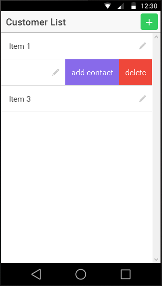
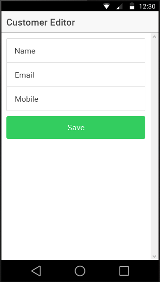
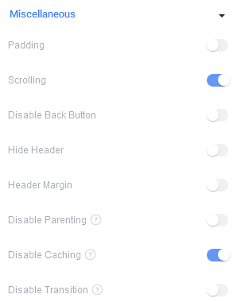
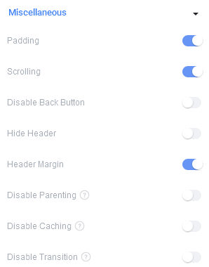

# Customer Mobile App Tutorial
## Pre-requisites
### Ionic (and Cordova)
1.  Register for an Ionic ID / Account: https://apps.ionic.io/signup
2.  Download and install the Ionic LAB (old<sup id="f1r">[1](#f1)</sup>): http://lab.ionic.io/old.html
3.  Install the Ionic View App on your Android or iOS powered Smartphone or Tablet: http://view.ionic.io/

### API Development
1.  (optional) Download and install Postman (for Windows you need Chrome): https://www.getpostman.com/

### Java EE
1.  WildFly Application server.
    - Including the JDBC MySQL Driver installed and configured.
2.  NetBeans IDE (EE Edition).
3.  A running MySQL Database instance.

## Java EE (JPA and EJB) and JAX-RS (REST) API
1.  Create a new Maven-based Web Project (running on WildFly)

2.  Create a persistence.xml file containing your data source link, such as: 
    ````
    java:/jboss/datasources/MySQLDS
    ````
    
3.  Create an Customer Entity Class for storing customer data, such as:
    ````java
    @Entity
    @XmlRootElement //optional
    public class Customer implements Serializable {
    
        private static final long serialVersionUID = 1L;
        @Id
        @GeneratedValue(strategy = GenerationType.AUTO)
        private Long id;
        private String name;
        private String email;
        private String mobile;
        // getters and setters
    }
    ````
    
4.  Create a CustomerEJB Class containing CRUD operations for the customer entity:
    ````java
    @Stateless
    public class CustomerEJB {
    
        @PersistenceContext(unitName = "primary")
        private EntityManager em;
    
        public List<Customer> findCustomers() {
            CriteriaQuery<Customer> criteria = em.getCriteriaBuilder().createQuery(Customer.class);
            criteria.select(criteria.from(Customer.class));
            return em.createQuery(criteria).getResultList();
        }
    
        public Customer findCustomerById(Long id) {
            return em.find(Customer.class, id);
        }
    
        public Customer createCustomer(Customer customer) {
            em.persist(customer);
            return customer;
        }
    
        public void deleteCustomer(Customer customer) {
            em.remove(customer);
        }
    
        public Customer updateCustomer(Customer customer) {
            return em.merge(customer);
        }
    }
    ````
    
5.  Create a RESTful API by writing a CustomerEndpoint Class:
    ````java
    @Stateless
    @Path("v1/customer")
    public class CustomerEndpoint {
    
        @EJB
        private CustomerEJB customerEJB;
    
        @POST
        @Consumes({MediaType.APPLICATION_XML, MediaType.APPLICATION_JSON})
        public void create(Customer entity) {
            customerEJB.createCustomer(entity);
        }
    
        @PUT
        @Consumes({MediaType.APPLICATION_XML, MediaType.APPLICATION_JSON})
        public void edit(Customer entity) {
            customerEJB.updateCustomer(entity);
        }
    
        @DELETE
        @Path("{id}")
        public void remove(@PathParam("id") Long id) {
            customerEJB.deleteCustomer(customerEJB.findCustomerById(id));
        }
    
        @GET
        @Path("{id}")
        @Produces({MediaType.APPLICATION_XML, MediaType.APPLICATION_JSON})
        public Customer find(@PathParam("id") Long id) {
            return customerEJB.findCustomerById(id);
        }
    
        @GET
        @Produces({MediaType.APPLICATION_XML, MediaType.APPLICATION_JSON})
        public List<Customer> findAll() {
            return customerEJB.findCustomers();
        }
        
    }
    ````
    
6.  Use NetBeans to "Configure REST using Java EE 6 specification" to automatically generate an ApplicationConfig. Please define the application Path as follows.
    ````java
    @javax.ws.rs.ApplicationPath("api")
    public class ApplicationConfig extends Application {
      // generated code
    }
    ````
    
7.  (optional for development purposes) Implement a CORS<sup id="f2r">[2](#f2)</sup> filter as follows:
    ````java
    @Provider
    public class CORSFilter implements ContainerResponseFilter{
    
        @Override
        public void filter(ContainerRequestContext requestContext, ContainerResponseContext responseContext) throws IOException {
            responseContext.getHeaders().add("Access-Control-Allow-Origin", "*");
            // the following code is optional
            responseContext.getHeaders().add("Access-Control-Allow-Methods", "GET, PUT, POST, DELETE");
            String requestheader = requestContext.getHeaderString("Access-Control-Request-Headers");
            if (requestheader != null && !"".equals(requestheader)) {
                responseContext.getHeaders().putSingle("Access-Control-Allow-Headers", requestheader);
            }
            responseContext.getHeaders().add("Access-Control-Max-Age", "86400");
        }
    }
    ````
    
8.  Run the API on your local WildFly server for development.
    - You may test your API with Postman: http://localhost:8080/CustomerMobileAPI-1.0/api/v1/customer
    - There is also Cloud-based API version accessible under: http://api-andreasmartin.rhcloud.com/api/v1/customer
    
## Ionic App Prototyping
We are going to use the Ionic Creator prototyping tool to create our development-ready HTML5 code.

1.  Login to the Ionic Creator using your Ionic ID: http://ionic.io/products/creator
2.  Create a blank Ionic App project.
3.  Create two pages as showed below:
    - Customer List (left screenshot):
        - Add a list with list items including "add contact" and "delete" swipe buttons.
        - Add a create button
    - Customer Editor (right screenshot): 
        - Add a form containing input fields for name, email and mobile.
        - Add a "Save" button.
    
    
    

4.  Make sure that you configure the Customer List (left) and the Customer Editor (right) as follows:  

    
    

5.  Export the project from the Ionic Creator.
6.  Download and extract the ZIP file.

## Ionic project creation
1.  Create a new Ionic App using Ionic Lab.
2.  Copy the project files from the Ionic Creator in the www folder.
3.  Run the embedded Ionic web-server (testing -> serve).

## Ionic App Development using AngularJS 1
-   Open the Ionic Project in an IDE you prefer (NetBeans, IntelliJ, WebStorm, etc.)
#### index.html
1.  Add the Angular resource module which is not included by default. Open index.html and add a script tag to include angular-resource.min.js (right after ionic-bundle.js):
    ```html
     <script src="lib/ionic/js/angular/angular-resource.min.js"></script>
    ```
    
2.  Externalize the CSS code and remove it from index.html
    ```html
    <link href="css/style.css" rel="stylesheet">
    ```
       
#### services.js
-  Implement two service factories to consume the Customer API
    ```javascript
    angular.module('app.services', ['ngResource'])
    
      .constant('ApiEndpoint', {
        url: 'http://api-andreasmartin.rhcloud.com/api'
      })
    
      .factory('CustomersFactory', function ($resource, ApiEndpoint) {
        return $resource(ApiEndpoint.url + '/v1/customer', {}, {
          query: {method: 'GET', isArray: true},
          update: {method: 'PUT'},
          create: {method: 'POST'}
        })
      })
    
      .factory('CustomerFactory', function ($resource, ApiEndpoint) {
        return $resource(ApiEndpoint.url + '/v1/customer/:id', {}, {
          show: {method: 'GET'},
          delete: {method: 'DELETE', params: {id: '@id'}}
        })
      });
    ```

#### controllers.js
1.  Implement three controllers for (1) the customer list, (2) updating and (3) creating a customer.
    ````javascript
    angular.module('app.controllers', [])
    ````
    
2.  Customer List Controller
    ````javascript
      .controller('customerListCtrl', ['$scope', '$stateParams', '$state', 'CustomersFactory', 'CustomerFactory',
        function ($scope, $stateParams, $state, CustomersFactory, CustomerFactory) {
          /* callback for ng-click 'editCustomer': */
          $scope.editCustomer = function (customerId) {
            $state.go('customerEditor', {customerId: customerId});
          };
    
          /* callback for ng-click 'deleteCustomer': */
          $scope.deleteCustomer = function (customerId) {
            CustomerFactory.delete({id: customerId});
            $scope.customers = CustomersFactory.query();
            $state.reload();
          };
    
          /* callback for ng-click 'createCustomer': */
          $scope.createCustomer = function () {
            $state.go('customerEditorCreate');
          };
    
          /* callback ion-refresher: */
          $scope.refreshCustomer = function () {
            $scope.customers = CustomersFactory.query();
            $scope.$broadcast('scroll.refreshComplete');
          };
    
          $scope.customers = CustomersFactory.query();
    
          /* callback for ng-click 'addCustomerContact': */
          $scope.addCustomerContact = function (customerId) {
            CustomerFactory.show({id: customerId}).$promise.then(function (customer) {/*...*/});
          };
    
        }])
    ````
    
3.  Customer Editor Controller
    ````javascript
      .controller('customerEditorCtrl', ['$scope', '$stateParams', '$state', 'CustomersFactory', 'CustomerFactory',
        function ($scope, $stateParams, $state, CustomersFactory, CustomerFactory) {
    
          /* callback for ng-click 'editCustomer': */
          $scope.editCustomer = function () {
            CustomersFactory.update($scope.customer);
            $state.go('customerList', {}, {reload: true});
          };
    
          $scope.customer = CustomerFactory.show({id: $stateParams.customerId});
    
        }])
    ````
    
4.  Customer Editor Create Controller for the creation view. 
    ````javascript
      .controller('customerEditorCreateCtrl', ['$scope', '$stateParams', '$state', 'CustomersFactory', 'CustomerFactory',
        function ($scope, $stateParams, $state, CustomersFactory, CustomerFactory) {
    
          /* callback for ng-click 'editCustomer': */
          $scope.editCustomer = function () {
            CustomersFactory.create($scope.customer);
            $state.go('customerList', {}, {reload: true});
          };
    
          $scope.customer = {};
    
        }]);
    ````

#### routes.js
-   Extend the routes.js file with an customerId URL segment and an additional route for the customer creation view.
    ````javascript
    angular.module('app.routes', [])
    
      .config(function ($stateProvider, $urlRouterProvider) {
    
        $stateProvider
    
          .state('customerList', {
            url: '/customers',
            templateUrl: 'templates/customerList.html',
            controller: 'customerListCtrl'
          })
    
          .state('customerEditor', {
            url: '/editor/:customerId',
            templateUrl: 'templates/customerEditor.html',
            controller: 'customerEditorCtrl'
          })
    
          .state('customerEditorCreate', {
            url: '/editor',
            templateUrl: 'templates/customerEditor.html',
            controller: 'customerEditorCreateCtrl'
          });
    
        $urlRouterProvider.otherwise('/customers')
    
      });
    ````

#### customerList.html
Extend the customer list file with ng-click, ng-repeat, model data and an ion-refresher.

````html
<ion-view title="Customer List" id="page1" style="" cache-view="false">
  <ion-nav-buttons side="right" class="has-header">
    <button class="button button-balanced icon ion-android-add" ng-click="createCustomer()"></button>
  </ion-nav-buttons>
  <ion-content padding="false" class=" manual-remove-top-padding has-header">
    <ion-refresher
      pulling-text="Pull to refresh..."
      on-refresh="refreshCustomer()">
    </ion-refresher>
    <ion-list id="customerList-list1">
      <ion-item class="item-icon-right" ng-repeat="customer in customers" style="" ng-click="editCustomer(customer.id)">
        <h2>{{customer.name}}</h2>
        <p>{{customer.email}} | {{customer.mobile}}</p>
        <i class="icon ion-edit icon-accessory"></i>
        <ion-option-button class="button-assertive" ng-click="deleteCustomer(customer.id)">delete</ion-option-button>
        <ion-option-button class="button-royal" ng-click="addCustomerContact(customer.id)">add contact</ion-option-button>
      </ion-item>
    </ion-list>
  </ion-content>
</ion-view>
````

#### customerEditor.html
Extend the customer editor file with ng-model and ng-click.

````html
<ion-view title="Customer Editor" id="page2" style="">
  <ion-content padding="true" class="has-header">
    <form id="customerEditor-form1" class="list">
      <ion-list id="customerEditor-list2">
        <label class="item item-input" id="customerEditor-input1">
          <span class="input-label">Name</span>
          <input placeholder="" type="text" ng-model="customer.name">
        </label>
        <label class="item item-input" id="customerEditor-input2">
          <span class="input-label">Email</span>
          <input placeholder="" type="email" ng-model="customer.email">
        </label>
        <label class="item item-input" id="customerEditor-input3">
          <span class="input-label">Mobile</span>
          <input placeholder="" type="tel" ng-model="customer.mobile">
        </label>
      </ion-list>
      <button id="customerEditor-button1" class="button button-balanced  button-block" ng-click="editCustomer()">Save</button>
    </form>
  </ion-content>
</ion-view>
````

## Ionic Cloud and View App
1.  Use Ionic Lab to Upload the project to Ionic Cloud.
2.  Use the Ionic View App to run the newly created mobile app on your smart-phone.

## Apache Cordova Plugin - Contacts
1.  Enable the "Contacts" Plugin in Ionic Lab.
2.  Extend the Customer List Controller with the native contact functionality:
    ````javascript
          /* callback for ng-click 'addCustomerContact': */
          $scope.addCustomerContact = function (customerId) {
            CustomerFactory.show({id: customerId}).$promise.then(function (customer) {
              var contact = navigator.contacts.create({'displayName': customer.name});
              contact.name = new ContactName({'formatted': customer.name});
              contact.phoneNumbers = new Array(new ContactField('mobile', customer.mobile, true));
              contact.emails = new Array(new ContactField('work', customer.email, true));
              contact.save(function (contact) {
                alert("Save Success");
              }, function (contactError) {
                alert("Error = " + contactError.code);
              });
            });
          };
    ````

3.  Re-upload the project to Ionic Cloud.
3.  Use the Ionic View App to test the contact functionality.

## Footnotes
<b id="f1">1:</b> Unfortunately Ionic Lab is no longer supported, in future you will have to use the Ionic CLI: http://ionicframework.com/docs/cli/install.html | http://ionicframework.com/docs/guide/installation.html
Ionic CLI requires the JavaScript runtime Node.js: https://nodejs.org  [↩](#f1r)

<b id="f2">2:</b> HTTP access control (CORS): https://developer.mozilla.org/en-US/docs/Web/HTTP/Access_control_CORS [↩](#f2r)
